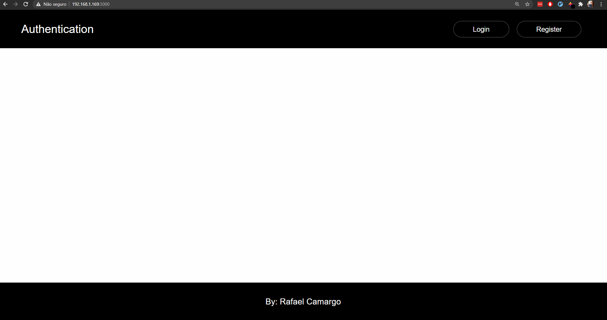

# Autenticação

Neste projeto, desenvolvi um sistema de autenticação e autorização utilizando tokens jwt. A aplicação permite que o usuário crie uma conta, informando um nome de usuário, email e senha. Logo após a criação da conta, o usuário é redirecionado para uma rota de login e pode entrar com seus dados para se autenticar. Se os dados estiverem corretos, o usuário será redirecionado para rota protegida `/dashboard`.

---

O formulário de cadastro é validado em tempo real, com as seguintes condições:

- O nome de usuário tem que ter entre 3 e 15 letras.
- A senha tem que ter no mínimo 8 caracteres.
- O email tem que ser um endereço válido.

Assim que as condições acima forem satisfeitas, o usuário poderá enviar os dados para a API na rota `/api/register` que deverá retornar erro caso o nome de usuário enviado já esteja registrado. Caso contrário, retornará status 200, e o usuário será redirecionado para rota `/login`.

Na rota `/login` o usuário preenche os campos **nome de usuário** e **senha** que serão enviados para rota `/api/login`. Lá será comparada a senha enviada pelo usuário com a do banco de dados, caso corresponda, a API retornará um token jwt, finalizando o processo de autenticação. 

Em seguida, a aplicação redirecionará o usuário para rota protegida, dando início ao processo de autorização. Antes de renderizar o componente da rota, será verificada a existência do token jwt no `localStorage`, caso exista, o usuário poderá acessar a rota `/dashboard` normalmente.

---

## Tecnologias Utilizadas

### Frontend

- React
- Formik
- axios
- styled-components
- Ant Design
- yup

### Backend

- JWT
- Express.js
- Typescript
- MongoDB
- mongoose
- bcrypt